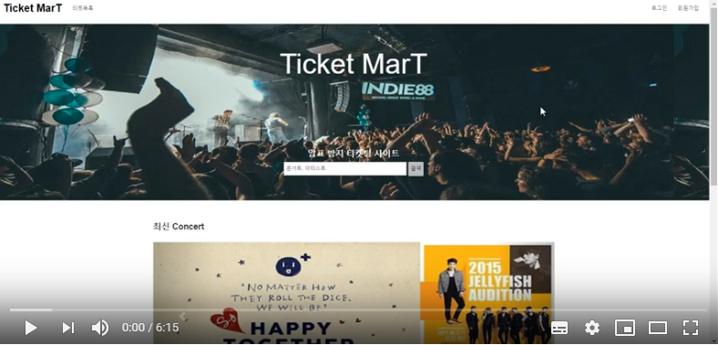

# Ticket_markeT

### What is this?

> Authentication System Using Facial Recognition

Ticket_markeT is ticketing site by using user authentication of Azure FaceAPI .

- Microsoft Azure FaceAPI
- bkfd2Password Encryption
- formidable upload Image
- passport(User Authentcation Library)

### Stack

> Front-end

* EJS
* jQuery
* BootStrap
* AJAX
* CSS3, JavaScript

> Server

* Node.js
* Express
* MySQL
* passport(User Authentcation Library)

### Result

